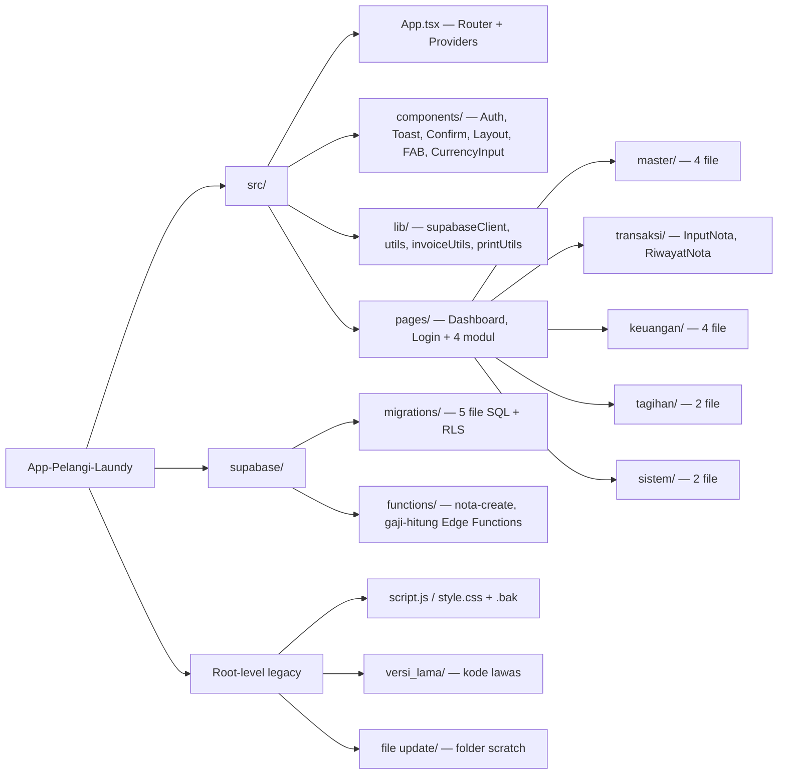
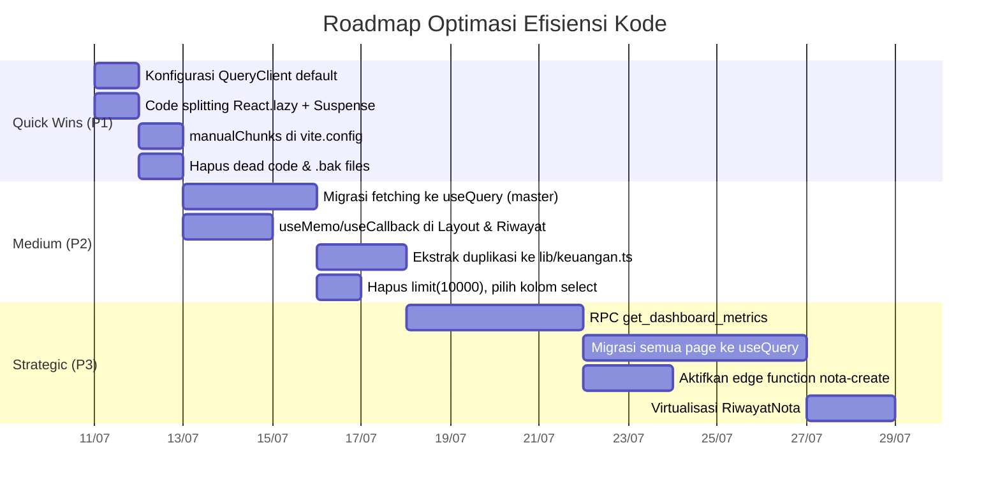

Setelah menganalisis seluruh struktur dan kode sumber repo `calvinsyah/App-Pelangi-Laundy` (React 19 + TypeScript + Vite 6 + Supabase + TanStack Query), berikut dokumen `.md` lengkap mengenai **Efisiensi & Kinerja Kode** yang bisa langsung Anda simpan ke repository.

---

````markdown
# 📊 Code Efficiency & Performance Analysis

### Aplikasi Pelangi Laundry (App-Pelangi-Laundy)

> Repo: https://github.com/calvinsyah/App-Pelangi-Laundy
> Stack: React 19 · TypeScript 5.8 · Vite 6 · Tailwind CSS 4 · Supabase · TanStack Query 5 · React Router 7 · @dnd-kit · motion (Framer Motion)
> Tanggal Analisis: 2026-07-10

---

## 1. Ringkasan Eksekutif

Aplikasi Pelangi Laundry adalah web app manajemen laundry (transaksi nota, tagihan, keuangan, master data) yang dibangun di atas stack modern. **Secara fungsional aplikasi sudah berjalan**, namun terdapat sejumlah **bottleneck efisiensi yang signifikan** yang akan membatasi skalabilitas saat volume data transaksi bertambah.

**Temuan paling kritis (Top 3):**

1. **TanStack Query ter-install (`@tanstack/react-query ^5.101`) tetapi praktis TIDAK digunakan.** Semua fetching data dilakukan manual dengan `useEffect + useState + supabase.from().select()`. `QueryClient` di- instantiate tanpa opsi default apapun (`new QueryClient()`), sehingga caching, deduplikasi, dan background refetch — alasan utama memakai library ini — terbuang sia-sia.
2. **`Dashboard.tsx` melakukan komputasi O(P × M × N × H) di main thread.** Halaman ini meng-fetch **seluruh riwayat nota & biaya** (paginated hingga endDate, bukan hanya periode terpilih), lalu melakukan nested loop `pelangganList × allBulanSet × notas` dengan `.find()` di dalamnya. Ini akan menghambat UI saat data melebihi beberapa ribu baris.
3. **Tidak ada code splitting.** Seluruh 14+ page component, `@dnd-kit`, dan `motion` di-import statis di `App.tsx`, sehingga semuanya masuk ke satu bundle awal meski user biasa tidak pernah membuka halaman admin.

**Potensi dampak perbaikan:**

- Initial bundle size: diperkirakan turun **30–50%** dengan code splitting + tree-shaking `motion`/`dnd-kit`.
- Waktu load Dashboard: dari potensi **beberapa detik** (saat data besar) menjadi **<500ms** dengan pemindahan komputasi ke Supabase RPC.
- Refetch berlebih: berkurang drastis dengan konfigurasi `staleTime` + adopsi `useQuery`.

---

## 2. Profil Proyek & Komposisi Kode


````

| Aspek                                          | Detail                                                                           |
| ---------------------------------------------- | -------------------------------------------------------------------------------- |
| Bahasa                                         | JavaScript 47.6% · TypeScript 33.7% · HTML 10.1% · CSS 8.6%                      |
| Total commit                                   | 26                                                                               |
| Dependency berat                               | `motion` (Framer Motion), `@dnd-kit/core`+`sortable`+`utilities`, `lucide-react` |
| Dependency terpasang tapi tidak terpakai penuh | `@tanstack/react-query`, `zod`, `react-hook-form`                                |
| Backend                                        | Supabase (PostgreSQL + Auth + RLS + 2 Edge Functions)                            |
| Deployment                                     | Vercel (`app-pelangi-laundy.vercel.app`)                                         |

---

## 3. Tabel Temuan Efisiensi (Prioritas Rapih)

| #   | Kategori      | Masalah                                                                   | Lokasi                                          | Dampak                               | Prioritas | Estimasi Effort |
| --- | ------------- | ------------------------------------------------------------------------- | ----------------------------------------------- | ------------------------------------ | --------- | --------------- |
| 1   | Data Fetching | React Query ter-install tapi tidak dipakai; `QueryClient` tanpa opsi      | `src/App.tsx:27`                                | Refetch berlebih, no cache, no dedup | 🔴 Tinggi | Sedang          |
| 2   | Algoritma     | Komputasi Dashboard O(P×M×N×H) di main thread                             | `src/pages/Dashboard.tsx:27-136`                | UI freeze saat data besar            | 🔴 Tinggi | Besar           |
| 3   | Bundling      | Tidak ada code splitting / `React.lazy`                                   | `src/App.tsx:10-26`                             | Bundle awal membengkak               | 🔴 Tinggi | Kecil           |
| 4   | Query DB      | `fetchAll` mengambil seluruh history nota & biaya (bukan per-periode)     | `src/pages/Dashboard.tsx:27-38`                 | Transfer data berlebih               | 🔴 Tinggi | Sedang          |
| 5   | Query DB      | `limit(10000)` pada payment_status, pelanggan, harga_pelanggan            | `src/pages/Dashboard.tsx:52-56`                 | Akan overflow saat >10k baris        | 🟡 Sedang | Kecil           |
| 6   | Rendering     | Tidak ada `useMemo`/`useCallback`/`React.memo`                            | `RiwayatNota.tsx`, `Layout.tsx`                 | Re-render tidak perlu                | 🟡 Sedang | Kecil           |
| 7   | Rendering     | RiwayatNota fetch semua nota + filter client-side, tanpa virtualisasi     | `src/pages/transaksi/RiwayatNota.tsx:32-62`     | Lag pada list panjang                | 🟡 Sedang | Sedang          |
| 8   | Duplikasi     | Logika `hitungTagihan` & `checkIsNotaFlat` duplikat Dashboard ↔ Laporan   | `Dashboard.tsx` & `Laporan.tsx`                 | Maintenance & bug ganda              | 🟡 Sedang | Kecil           |
| 9   | Edge Function | `nota-create` ada tapi InputNota bypass & langsung `.insert()`            | `InputNota.tsx:248` vs `functions/nota-create/` | Validasi server tidak terpakai       | 🟡 Sedang | Sedang          |
| 10  | Memory        | `allData = [...allData, ...data]` di loop pagination → O(n²)              | `Dashboard.tsx:34`                              | Memory spike                         | 🟡 Sedang | Kecil           |
| 11  | Build Config  | `vite.config.ts` tanpa `manualChunks`, tanpa compression                  | `vite.config.ts`                                | Bundle tidak dioptimasi              | 🟡 Sedang | Kecil           |
| 12  | Repo Hygiene  | `script.js`, `style.css`, `index.html.bak`, `versi_lama/`, `file update/` | Root repo                                       | Build context bengkak                | 🟢 Rendah | Kecil           |
| 13  | TS Config     | `allowJs: true` menyertakan `script.js` legacy ke compilation context     | `tsconfig.json:16`                              | Build lebih lambat                   | 🟢 Rendah | Kecil           |
| 14  | N+1 Pattern   | 3 query terpisah + `.find()` di JS untuk config linen                     | `InputNota.tsx:117-133`, `printUtils.ts:89-111` | Round-trip berlebih                  | 🟡 Sedang | Sedang          |
| 15  | Robustness    | Tidak ada Error Boundary                                                  | `src/App.tsx`                                   | Crash total pada error               | 🟢 Rendah | Kecil           |

---

## 4. Analisis Detail per Kategori

### 4.1 State Management & Data Fetching — "React Query yang Terlupakan"

#### Temuan

`package.json` memasang `@tanstack/react-query ^5.101.2`, dan `App.tsx` membungkus aplikasi dengan `QueryClientProvider`. Namun:

```ts
// src/App.tsx:27 — QueryClient tanpa konfigurasi apapun
const queryClient = new QueryClient();
```

```ts
// src/pages/Dashboard.tsx — pola fetching yang dipakai di SEMUA page
const [metrics, setMetrics] = useState({...});
const [loading, setLoading] = useState(true);
useEffect(() => {
  async function calculateMetrics() {
    setLoading(true);
    const { data } = await supabase.from('nota').select('*')...
    setMetrics(...);
    setLoading(false);
  }
  calculateMetrics();
}, [periode]);
```

Pola `useEffect + useState + supabase` ini diulang di **Dashboard, Laporan, RiwayatNota, InputNota, MasterPelanggan, Utang, Pengeluaran, AbsensiGaji, Backup, Pengaturan, dan semua Master**. React Query sama sekali tidak dipanggil.

#### Mengapa Ini Masalah Efisiensi

- **Tanpa `staleTime`, default = 0** → setiap mount component memicu refetch network meski data baru saja diambil.【turn20search5】【turn20search9】
- **Tanpa cache sharing** → data `pelanggan`, `jenis_nota`, `master_linen` yang dipakai di banyak halaman di-fetch berulang setiap navigasi.
- **Tanpa deduplikasi** → jika 2 component meminta data sama di render yang sama, 2 request terjadi.
- **Tanpa background refetch / optimistic update** → setelah mutasi (insert/update/delete), developer memanggil `fetchX()` manual untuk refresh (lihat `Utang.tsx:82`, `RiwayatNota.tsx:74`).

#### Rekomendasi

**Langkah 1 — Konfigurasi `QueryClient` default:**

```ts
// src/App.tsx
const queryClient = new QueryClient({
  defaultOptions: {
    queries: {
      staleTime: 60_000, // 1 menit data dianggap fresh
      gcTime: 5 * 60_000, // cache disimpan 5 menit
      refetchOnWindowFocus: false, // matikan refetch saat focus (opsional)
      retry: 1,
    },
  },
});
```

**Langkah 2 — Migrasi fetching ke `useQuery`:**

```ts
// src/pages/keuangan/Laporan.tsx (contoh)
const { data, isLoading } = useQuery({
  queryKey: ["laporan", periode],
  queryFn: async () => {
    const { data, error } = await supabase
      .from("nota")
      .select("*, pelanggan(id, nama, tipe_billing, tarif_flat)")
      .gte("tanggal", `${periode}-01`)
      .lte("tanggal", endDate);
    if (error) throw error;
    return data;
  },
});
```

**Langkah 3 — Query key stabil untuk data master (dipakai lintas halaman):**

```ts
// Mis. di lib/queries.ts
export const usePelanggan = () =>
  useQuery({
    queryKey: ["pelanggan"],
    queryFn: () =>
      supabase
        .from("pelanggan")
        .select("*")
        .order("nama")
        .then((r) => r.data ?? []),
    staleTime: 10 * 60_000, // master data jarang berubah
  });
```

**Langkah 4 — Mutasi dengan `useMutation` + `invalidateQueries`** menggantikan `fetchX()` manual:

```ts
const mutation = useMutation({
  mutationFn: (newUtang) => supabase.from("utang").insert([newUtang]),
  onSuccess: () => queryClient.invalidateQueries({ queryKey: ["utang"] }),
});
```

---

### 4.2 Algoritma & Komputasi — Bottleneck `Dashboard.tsx`

#### Temuan

`Dashboard.tsx` adalah halaman paling berat secara komputasi. Alur saat ini:

```ts
// 1. Fetch PAGINATION seluruh nota & biaya hingga endDate (bukan per bulan!)
const fetchAll = async (table, dateCol) => {
  let allData = [];
  let from = 0,
    step = 1000;
  while (true) {
    const { data } = await supabase
      .from(table)
      .select("*")
      .lte(dateCol, endDate)
      .range(from, from + step - 1);
    if (!data || data.length === 0) break;
    allData = [...allData, ...data]; // ⚠ O(n²) array spread
    if (data.length < step) break;
    from += step;
  }
  return allData;
};

// 2. Fetch 6 tabel lain dengan limit(10000)
// 3. Bangun allBulanSet dari SEMUA tanggal nota (bisa puluhan bulan)
// 4. Nested loop: pelangganList × allBulanSet × hitungTagihan
pelangganList.forEach((p) => {
  allBulanSet.forEach((bln) => {
    const tagihan = hitungTagihan(p, allNotas, bln); // internal: notas.filter + .find harga
  });
});
```

#### Kompleksitas

- `hitungTagihan` memanggil `arrNota.filter(...)` → **O(N)** per pelanggan per bulan.
- `hargaPelanggan?.find(...)` di dalam loop nota RS → **O(H)** per item.
- Total: **O(P × M × N × H)** dengan P=pelanggan, M=bulan unik, N=nota, H=harga_pelanggan.
- Ditambah `allData = [...allData, ...data]` di pagination → **O(n²)** untuk penggabungan array.

Untuk dataset sederhana ini mungkin masih cepat, tetapi pertumbuhan data bulanan akan membuat Dashboard melambat secara kuadratik.

#### Rekomendasi (berurutan dari murah ke invest)

**A. Perbaikan cepat di client (low effort, medium gain):**

```ts
// 1. Ganti spread dengan push (O(n) vs O(n²))
allData.push(...data);

// 2. Bangun index Map sekali, bukan .find() berulang
const hargaMap = new Map();
hargaPelanggan?.forEach((h) =>
  hargaMap.set(`${h.pelanggan_id}_${h.linen_id}`, h.harga),
);

const notaByPelangganByBln = new Map();
allNotas.forEach((n) => {
  const bln = n.tanggal?.substring(0, 7);
  const key = `${n.pelanggan_id}_${bln}`;
  if (!notaByPelangganByBln.has(key)) notaByPelangganByBln.set(key, []);
  notaByPelangganByBln.get(key).push(n);
});

// 3. Batasi allBulanSet hanya ke periode yang relevan (mis. 12 bulan terakhir)
```

**B. Pindahkan komputasi ke database (high gain, medium effort):**

Buat **Supabase RPC (PostgreSQL function)** yang mengembalikan metrik langsung:

```sql
create or replace function get_dashboard_metrics(p_periode text)
returns json as $$
declare
  result json;
begin
  with
    notas_bulan as (
      select pelanggan_id, sum(total) as omset
      from nota
      where to_char(tanggal::date, 'YYYY-MM') = p_periode
      group by pelanggan_id
    ),
    biaya_bulan as (
      select kategori, sum(nominal) as total
      from biaya
      where to_char(tanggal::date, 'YYYY-MM') = p_periode
      group by kategori
    )
  select json_build_object(
    'omset', coalesce((select sum(omset) from notas_bulan), 0),
    'hpp', coalesce((select sum(total) from biaya_bulan
                     where kategori in ('GAS','AIR','LISTRIK 1','LISTRIK 2','CHEMICAL','BBM','PLASTIK','GAJI BORONGAN')), 0)
  ) into result;
  return result;
end;
$$ language plpgsql security definer;
```

Panggil dari client:

```ts
const { data } = await supabase.rpc("get_dashboard_metrics", {
  p_periode: periode,
});
```

**C. Memoize hasil jika tetap di client:**

```ts
const metrics = useMemo(() => calculateMetrics(allNotas, allBiayas, ...), [periode, allNotas, allBiayas]);
```

---

### 4.3 Bundling & Code Splitting

#### Temuan

`App.tsx` mengimpor **semua 14+ page secara statis**:

```ts
import Dashboard from "./pages/Dashboard";
import MasterLinen from "./pages/master/MasterLinen";
// ... 12 import lainnya
```

Tidak ada `React.lazy`, tidak ada `Suspense`. Akibatnya:

- `motion` (Framer Motion, ~50KB gzip) dimuat meski hanya dipakai di animasi tertentu.
- `@dnd-kit/core + sortable + utilities` (~30KB gzip) hanya dipakai di `MasterPelanggan` & `MasterJenisNota`.
- Seluruh halaman admin (gaji, laporan, backup) masuk bundle awal meski user role `user` tidak bisa mengaksesnya.

`vite.config.ts` juga tidak punya `build.rollupOptions.manualChunks`:

```ts
// vite.config.ts saat ini — minimalis
export default defineConfig(() => ({
  plugins: [react(), tailwindcss()],
  resolve: { alias: { "@": path.resolve(__dirname, ".") } },
  // tidak ada build.rollupOptions
}));
```

#### Rekomendasi

**A. Lazy load semua route:**

```tsx
// src/App.tsx
import { lazy, Suspense } from "react";

const Dashboard = lazy(() => import("./pages/Dashboard"));
const MasterLinen = lazy(() => import("./pages/master/MasterLinen"));
const MasterPelanggan = lazy(() => import("./pages/master/MasterPelanggan"));
const InputNota = lazy(() => import("./pages/transaksi/InputNota"));
// ... dst

// Bungkus Routes dengan Suspense
<Suspense fallback={<div className="p-8 text-center">Memuat…</div>}>
  <Routes>...</Routes>
</Suspense>;
```

**B. Pisahkan vendor chunk:**

```ts
// vite.config.ts
build: {
  rollupOptions: {
    output: {
      manualChunks: {
        'react-vendor': ['react', 'react-dom', 'react-router-dom'],
        'supabase': ['@supabase/supabase-js'],
        'query': ['@tanstack/react-query'],
        'dnd': ['@dnd-kit/core', '@dnd-kit/sortable', '@dnd-kit/utilities'],
        'motion': ['motion'],
        'icons': ['lucide-react'],
      },
    },
  },
  chunkSizeWarningLimit: 600,
},
```

**C. Audit dependency yang terpasang tapi tidak terpakai:**

`zod` dan `react-hook-form` ada di `package.json` tetapi tidak ditemukan pemakaian signifikan di page transaksi (form ditulis manual dengan `useState`). Hapus jika memang tidak dipakai, atau manfaatkan untuk menggantikan validasi manual di `InputNota.tsx:202-217`.

---

### 4.4 React Rendering & Re-render

#### Temuan

Hampir tidak ada optimasi rendering yang diterapkan:

```ts
// src/components/Layout.tsx — navGroups didefinisikan ulang setiap render
const navGroups = [
  /* ... 4 group, 14 item */
]; // ⚠ array baru tiap render
const filteredGroups = navGroups.filter((g) => isAdmin || !g.adminOnly);
```

```ts
// src/pages/transaksi/RiwayatNota.tsx:87 — filter tanpa useMemo
const filteredNota = notaList.filter((n) =>
  n.pelanggan?.nama?.toLowerCase().includes(searchQuery.toLowerCase()),
);
// setiap ketikan memicu re-filter, ok; tapi setiap state change lain juga
```

```ts
// RiwayatNota — render seluruh list tanpa virtualisasi
{notaList.map(...)}
```

#### Rekomendasi

**A. `useMemo` untuk struktur statis dependen state:**

```ts
// Layout.tsx
const navGroups = useMemo(
  () => [
    /* ... */
  ],
  [],
);
const filteredGroups = useMemo(
  () => navGroups.filter((g) => isAdmin || !g.adminOnly),
  [navGroups, isAdmin],
);
```

**B. `useMemo` untuk derived list:**

```ts
// RiwayatNota.tsx
const filteredNota = useMemo(
  () =>
    notaList.filter((n) =>
      n.pelanggan?.nama?.toLowerCase().includes(searchQuery.toLowerCase()),
    ),
  [notaList, searchQuery],
);
```

**C. `useCallback` untuk handler yang diteruskan ke child:**

```ts
// InputNota.tsx
const updateQty = useCallback((index: number, val: string) => {
  setDisplayedLinen((prev) => {
    const next = [...prev];
    next[index] = { ...next[index], qty: Math.max(0, parseInt(val) || 0) };
    return next;
  });
}, []);
```

**D. Virtualisasi list panjang (RiwayatNota saat data >100 baris):**

Pertimbangkan `@tanstack/react-virtual` untuk merender hanya item yang terlihat.

**E. `React.memo` untuk item list:**

```tsx
const NotaRow = React.memo(function NotaRow({ nota, onEdit, onDelete }) {
  return (/* ... */);
});
```

---

### 4.5 Supabase Query Efficiency

#### Temuan

| Pola                                | Lokasi                              | Masalah                                                          |
| ----------------------------------- | ----------------------------------- | ---------------------------------------------------------------- |
| `select('*')` di hampir semua query | Dashboard, Laporan, RiwayatNota     | Mengambil kolom yang tidak dipakai (audit_log, inserted_at, dll) |
| `limit(10000)` sebagai "pengaman"   | Dashboard:52-56                     | Akan silent-truncate saat data >10k                              |
| 3 query terpisah untuk config linen | InputNota:117-121, printUtils:89-93 | Round-trip network 3×, lalu `.find()` di JS                      |
| Nested select sudah dipakai         | RiwayatNota:36-40                   | ✅ Praktik baik, perlu diperluas                                 |
| Filter tanggal via `gte/lte` string | Dashboard, Laporan                  | OK, tapi bisa pakai `to_char` di DB untuk akurasi                |

#### Rekomendasi

**A. Pilih kolom yang dibutuhkan saja:**

```ts
// Sebelum
supabase.from("nota").select("*");

// Sesudah
supabase
  .from("nota")
  .select(
    "id, tanggal, pelanggan_id, total, status_bayar, items, jenis, berat_kg",
  );
```

**B. Hapus `limit(10000)`, gunakan pagination atau RPC agregat.** Jika memang butuh semua, dokumentasikan batasnya.

**C. Gunakan nested select Supabase (PostgREST join) untuk config linen:**

```ts
const { data } = await supabase
  .from("pelanggan")
  .select(
    `
    id, nama,
    linen_pelanggan(linen_id, urutan),
    harga_pelanggan(linen_id, harga),
    master_linen!linen_pelanggan_linen_id_fkey(id, nama)
  `,
  )
  .eq("id", pId)
  .single();
```

Ini menggantikan 3 query terpisah + `.find()` di JS dengan 1 request.

**D. Pertimbangkan DB View** untuk `laporan_keuangan_bulanan` yang menggabungkan nota + biaya + payment_status, lalu query view dari client.

**E. Edge function `gaji-hitung`** sudah benar memindahkan komputasi gaji ke server — pola ini harus direplikasi untuk Dashboard & Laporan.

---

### 4.6 Duplikasi Logika Antar Modul

#### Temuan

Logika berikut muncul di **dua atau lebih file** dengan implementasi hampir identik:

| Logika                               | Lokasi 1                                                   | Lokasi 2               |
| ------------------------------------ | ---------------------------------------------------------- | ---------------------- |
| `hitungTagihan(p, notas, bln)`       | `Dashboard.tsx:74`                                         | `Laporan.tsx` (inline) |
| `checkIsNotaFlat(nota)`              | `Dashboard.tsx:60`                                         | `Laporan.tsx:60`       |
| Daftar kategori HPP                  | `Dashboard.tsx:142-150`                                    | `Laporan.tsx:87`       |
| Perhitungan `lastDay` dari `YYYY-MM` | `Dashboard.tsx:24`, `Laporan.tsx:24`, `RiwayatNota.tsx:49` | `App.tsx:42`           |
| Config linen fetch+sort              | `InputNota.tsx:117-138`                                    | `printUtils.ts:89-111` |

#### Rekomendasi

Ekstrak ke `src/lib/keuangan.ts` dan `src/lib/linenConfig.ts`:

```ts
// src/lib/dateUtils.ts
export const getLastDayOfMonth = (periodeYYYYMM: string): string => {
  const [y, m] = periodeYYYYMM.split("-").map(Number);
  return `${periodeYYYYMM}-${String(new Date(y, m, 0).getDate()).padStart(2, "0")}`;
};

export const getMonthRange = (periode: string) => ({
  start: `${periode}-01`,
  end: getLastDayOfMonth(periode),
});

// src/lib/keuangan.ts
export const HPP_CATEGORIES = [
  "GAS",
  "AIR",
  "LISTRIK 1",
  "LISTRIK 2",
  "CHEMICAL",
  "BBM",
  "PLASTIK",
  "GAJI BORONGAN",
];
export const ADM_CATEGORIES = [
  "GAJI TETAP",
  "MAKAN",
  "PERAWATAN MESIN",
  "IURAN SAMPAH",
  "IURAN RT",
  "LAIN-LAIN",
];

export const checkIsNotaFlat = (nota: any) =>
  nota.jenis === "FLAT" || nota.jenis === "FLAT ASLI";

export const hitungTagihan = (pData, arrNota, prefixBln, hargaMap) => {
  /* ... */
};
```

Selain mengurangi duplikasi, ini **mempermudah memoization** dan **testing unit**.

---

### 4.7 Edge Function yang Tidak Terpakai

#### Temuan

`supabase/functions/nota-create/index.ts` berisi validasi server-side yang baik:

```ts
// nota-create/index.ts — ada validasi totalQty, berat_kg, dll
if (isFlat) {
  if (berat_kg <= 0) throw new Error("Berat (Kg) harus > 0 untuk nota Flat");
} else {
  if (!items || items.length === 0)
    throw new Error("Harus ada item untuk nota Reguler");
  const totalQty = items.reduce((sum, item) => sum + Number(item.qty), 0);
  if (totalQty <= 0) throw new Error("Total qty item harus > 0");
}
```

Namun `InputNota.tsx:248` **tidak memanggil edge function ini**, melainkan langsung:

```ts
const { error: notaErr } = await supabase
  .from("nota")
  .insert([{ ...notaData, nota_id }]);
```

Validasi yang sama diulang manual di client (`InputNota.tsx:202-217`). Edge function menjadi **dead code** di production.

#### Rekomendasi

Pilih salah satu:

- **Opsi A (disarankan):** Panggil edge function via `supabase.functions.invoke('nota-create', { body })` agar validasi server berlaku, hapus duplikasi client.
- **Opsi B:** Hapus edge function jika memang tidak dipakai, dokumentasikan bahwa validasi sepenuhnya di client (kurang disarankan dari sisi keamanan).

`gaji-hitung` sepertinya sudah dipakai — verifikasi pemakaiannya di `AbsensiGaji.tsx`.

---

### 4.8 Build Configuration & Repo Hygiene

#### Temuan

```ts
// vite.config.ts — sangat minimal
export default defineConfig(() => ({
  plugins: [react(), tailwindcss()],
  resolve: { alias: { "@": path.resolve(__dirname, ".") } },
  server: {
    /* HMR config */
  },
  // ❌ tidak ada build.rollupOptions
  // ❌ tidak ada plugin compression (brotli/gzip)
  // ❌ tidak ada visualizer
}));
```

```json
// tsconfig.json
"allowJs": true,   // menyertakan script.js (legacy) ke context TS
```

File/folder yang tidak perlu di repo production:

- `script.js`, `script.js.bak`, `style.css`, `style.css.bak`, `index.html.bak` (legacy sebelum migrasi ke React)
- `versi_lama/` (kode versi lama)
- `file update/` (folder scratch)
- `plan_master_linen.json`, `prd_final.md`, `note.txt` (artefak planning)

#### Rekomendasi

**A. Tambahkan optimasi build di `vite.config.ts`:**

```ts
import { compression } from 'vite-plugin-compression2'; // atau vite-plugin-compression

plugins: [react(), tailwindcss(), compression({ algorithm: 'brotliCompress' })],

build: {
  target: 'es2022',
  minify: 'esbuild',
  cssMinify: true,
  sourcemap: false, // matikan di production
  rollupOptions: { output: { manualChunks: { /* lihat 4.3B */ } } },
},
```

**B. Set `allowJs: false`** di `tsconfig.json` setelah `script.js` dihapus.

**C. Bersihkan root repo:**

```bash
git rm script.js script.js.bak style.css style.css.bak index.html.bak
git rm -r versi_lama "file update"
# atau pindahkan ke branch archive: git checkout -b archive/legacy
```

**D. Tambahkan `vite-plugin-inspect` atau `rollup-plugin-visualizer`** untuk audit bundle secara berkala:

```ts
import { visualizer } from "rollup-plugin-visualizer";
plugins: [, /* ... */ visualizer({ open: true, filename: "dist/stats.html" })];
```

**E. Tambahkan Error Boundary** agar error di satu page tidak merontokkan seluruh app:

```tsx
// src/components/ErrorBoundary.tsx
import { Component, ReactNode } from "react";
export class ErrorBoundary extends Component<
  { children: ReactNode },
  { hasError: boolean }
> {
  state = { hasError: false };
  static getDerivedStateFromError() {
    return { hasError: true };
  }
  componentDidCatch(err: unknown) {
    console.error("App error:", err);
  }
  render() {
    return this.state.hasError ? (
      <div>
        Terjadi kesalahan. <a href="/">Muat ulang</a>
      </div>
    ) : (
      this.props.children
    );
  }
}
```

---

### 4.9 Memory & Resource Management

#### Temuan Kecil tapi Layak Diperbaiki

| Pola                                                 | Lokasi                             | Catatan                                                                     |
| ---------------------------------------------------- | ---------------------------------- | --------------------------------------------------------------------------- |
| `Date.now()` sebagai ID toast                        | `ToastProvider.tsx:23`             | Bisa collide jika 2 toast dalam ms yang sama; gunakan counter increment     |
| `terbilang()` rekursif                               | `utils.ts:7-32`                    | OK untuk angka wajar; batasi input maksimal triliun                         |
| `Math.random()` untuk `nota_id`                      | `InputNota.tsx:247`, `utils.ts:59` | Risiko collision rendah tapi ada; `invoice_counter` sudah ada — gunakan itu |
| `window.open` di `printUtils.ts:27` tanpa cleanup    | `printUtils.ts`                    | Popup yang tidak tertutup membebani memory                                  |
| Subscription auth tidak di-cancel jika unmount cepat | `AuthContext.tsx:21-35`            | Sudah di-cleanup via return — ✅ baik                                       |

---

## 5. Roadmap Implementasi



---

## 6. Target Metrik Pasca-Optimasi

| Metrik                       | Saat Ini (estimasi) | Target          | Cara Ukur                   |
| ---------------------------- | ------------------- | --------------- | --------------------------- |
| Initial JS bundle (gzip)     | ~250–350 KB         | < 150 KB        | `vite build` + `visualizer` |
| Time to Interactive (3G)     | ~3–5 s              | < 2 s           | Lighthouse                  |
| Dashboard load (1000 nota)   | ~2–4 s              | < 500 ms        | Performance trace DevTools  |
| Refetch network per navigasi | 5–8 request         | 0–1 (cache hit) | Network tab                 |
| Re-render Layout per nav     | Full re-render      | Memoized        | React DevTools Profiler     |

---

## 7. Checklist Penutup

- [ ] `QueryClient` diberi `defaultOptions` (staleTime, gcTime)
- [ ] Minimal data master (`pelanggan`, `jenis_nota`, `master_linen`) dimigrasi ke `useQuery`
- [ ] Semua route di `App.tsx` menggunakan `React.lazy`
- [ ] `vite.config.ts` memiliki `manualChunks` + compression
- [ ] `Dashboard.tsx` menggunakan RPC atau setidaknya `useMemo` + index `Map`
- [ ] `allData = [...allData, ...data]` diganti `.push(...data)`
- [ ] `limit(10000)` dihapus atau diganti pagination
- [ ] `select('*')` diganti select kolom spesifik
- [ ] Duplikasi `hitungTagihan`/`checkIsNotaFlat` diekstrak ke `lib/`
- [ ] Edge function `nota-create` dipanggil dari `InputNota` atau dihapus
- [ ] `script.js`, `*.bak`, `versi_lama/`, `file update/` dihapus dari repo
- [ ] `tsconfig.allowJs: false`
- [ ] Error Boundary dipasang di root
- [ ] `useMemo`/`useCallback` di `Layout.tsx`, `RiwayatNota.tsx`, `InputNota.tsx`
- [ ] Lighthouse audit > 90 (Performance) pada build production

---

- Dokumen ini disusun berdasarkan analisis langsung terhadap kode sumber pada branch `main` per 2026-07-10. Angka kompleksitas dan estimasi ukuran bundle bersifat indikatif — ukur dengan tool profiling (`rollup-plugin-visualizer`, React DevTools Profiler, Lighthouse) untuk validasi.

```

---

### Catatan singkat

Dokumen di atas sudah mencakup seluruh aspek efisiensi kode yang ditemukan di repo Anda: **misuse React Query, bottleneck komputasi Dashboard, tanpa code splitting, duplikasi logika, edge function tak terpakai, repo hygiene, dan build config**. Setiap temuan disertai lokasi file:baris, penjelasan dampak, contoh kode before/after, serta prioritas dan effort estimasi — sehingga bisa langsung Anda jadikan backlog kerja.

Beberapa hal yang sebaiknya Anda validasi sendiri setelah menerapkan: ukur bundle size aktual dengan `rollup-plugin-visualizer` (angka 250–350 KB adalah estimasi berdasarkan dependency list), dan profile Dashboard dengan dataset >1000 nota untuk memastikan dampak migrasi ke RPC Supabase.
```
