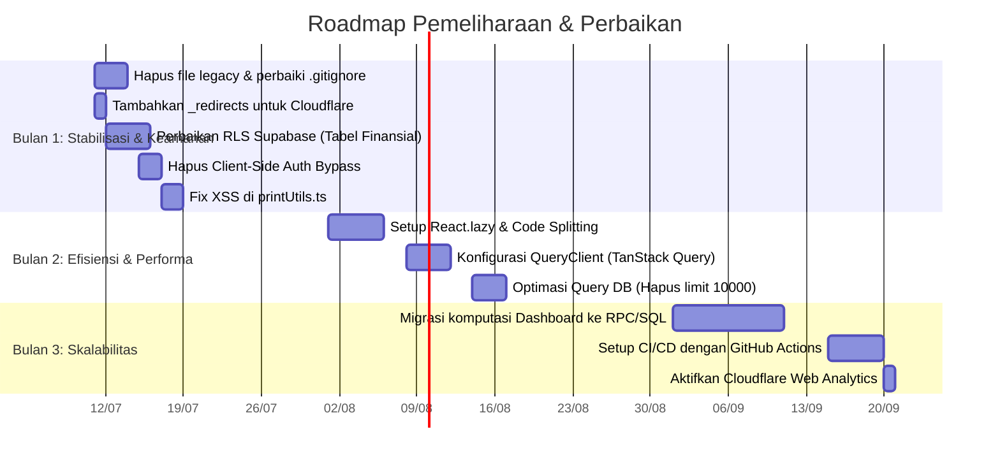

Terima kasih atas koreksinya. Penggunaan Cloudflare Pages memang pilihan yang sangat tepat untuk aplikasi Vite/React, terutama dari segi kecepatan _caching_ global (CDN) dan biaya.

Berikut adalah file `MAINTENANCE_PLAN.md` yang telah disesuaikan sepenuhnya dengan environment **Cloudflare Pages** dan link terbaru Anda.

---

```markdown
# 🛠️ Rencana Pemeliharaan Aplikasi (Maintenance Plan)

### Aplikasi Pelangi Laundry (App-Pelangi-Laundy)

> Repo: https://github.com/calvinsyah/App-Pelangi-Laundy
> Live URL: https://app-pelangi-laundy.pages.dev/
> Stack: React 19 · TypeScript · Vite · Supabase · Cloudflare Pages · Playwright
> Tanggal Dibuat: 10 Juli 2026

Dokumen ini menjelaskan strategi, jadwal, dan prosedur pemeliharaan (maintenance) untuk memastikan aplikasi Pelangi Laundry tetap berjalan stabil, aman dari ancaman, dan performa tetap optimal seiring pertumbuhan data pada platform Cloudflare Pages dan Supabase.

---

## 1. Tujuan Pemeliharaan (Maintenance Objectives)

1. **Ketersediaan (Availability):** Memastikan aplikasi _uptime_ tinggi (bergantung pada SLA Cloudflare & Supabase).
2. **Keamanan (Security):** Melindungi data finansial pengguna dari akses tidak sah dan memastikan konfigurasi _environment variables_ di Cloudflare aman.
3. **Performa (Performance):** Memanfaatkan cache global Cloudflare agar waktu muat aplikasi < 1.5 detik di seluruh Indonesia.
4. **Kebersihan Kode (Code Hygiene):** Mengelola _technical debt_ dan memastikan repo bersih dari file sampah.

---

## 2. Kategori Pemeliharaan

1. **Preventif (Preventive):** Pembaruan rutin dependensi, pembersihan repo, backup data Supabase.
2. **Korektif (Corrective):** Perbaikan _bug_ yang dilaporkan atau terdeteksi via Cloudflare Logs / Supabase Logs.
3. **Adaptif (Adaptive):** Penyesuaian karena perubahan API pihak ketiga (misal: Cloudflare routing rules, Supabase API) atau _browser_ policy.
4. **Perfektif (Perfective):** Optimasi kode (refactor) berdasarkan laporan analisis efisiensi sebelumnya.

---

## 3. Jadwal Pemeliharaan Rutin

| Frekuensi    | Tugas                               | Penanggung Jawab | Detail                                                                                                |
| ------------ | ----------------------------------- | ---------------- | ----------------------------------------------------------------------------------------------------- |
| **Harian**   | Cek Error Log Cloudflare & Supabase | Developer        | Pantau dashboard Cloudflare Pages (bagian Functions/Logs) dan Supabase Logs untuk runtime error.      |
| **Harian**   | Cek Backup Database                 | Developer        | Pastikan automated backup Supabase berjalan (Plan Pro/Free).                                          |
| **Mingguan** | Review PR & Merge branch            | Developer        | Evaluasi Pull Request di GitHub. Pastikan lulus Playwright test sebelum merge ke `main`.              |
| **Mingguan** | Hapus File Sampah                   | Developer        | Hapus file `*.bak`, konten folder `file update/`, dan log lokal.                                      |
| **Bulanan**  | Update Dependencies (Minor/Patch)   | Developer        | Jalankan `npm outdated` dan update package. Hindari major update langsung tanpa pengujian.            |
| **Bulanan**  | Audit Keamanan RLS Supabase         | Developer/DBA    | Review policy RLS di Supabase, pastikan tidak ada tabel finansial yang terbuka.                       |
| **Kuartal**  | Major Framework Update              | Developer        | Evaluasi upgrade major version (misal: React 19 ke 20, Vite 7). Uji di Cloudflare Preview Deployment. |

---

## 4. Prosedur Teknis Spesifik (SOP)

### 4.1. Manajemen Deployment di Cloudflare Pages

Cloudflare Pages terhubung langsung ke GitHub. Setiap _push_ ke branch `main` akan memicu build otomatis.
**SOP Rollback:**
Jika deployment produksi rusak:

1. Buka dashboard Cloudflare Pages > Project `App-Pelangi-Laundy`.
2. Masuk ke tab **Deployments**.
3. Cari deployment versi sebelumnya yang stabil.
4. Klik menu titik tiga (...) dan pilih **Rollback to this deployment**.
   _(Catatan: Rollback di Cloudflare bersifat instan karena menggunakan cache immutable, tidak perlu menunggu proses build)._

### 4.2. Konfigurasi SPA Routing (Penting!)

Karena ini adalah aplikasi React Router (SPA), refresh halaman atau akses langsung ke URL (misal: `/transaksi/input`) akan menghasilkan error **404 Not Found** di Cloudflare Pages jika tidak dikonfigurasi.
**SOP Fix/Tambahan:**
Pastikan ada file `public/_redirects` berisi:
```

/\* /index.html 200

````
*Jika file ini belum ada, tambahkan ke repo dan deploy ulang sebagai bagian dari maintenance preventif.*

### 4.3. Manajemen Environment Variables
Supabase membutuhkan URL dan Anon Key. Di Vercel ini ada di Project Settings, di Cloudflare Pages:
1. Masuk ke Cloudflare Pages > Project Settings > Environment variables.
2. Pastikan `VITE_SUPABASE_URL` dan `VITE_SUPABASE_ANON_KEY` terisi.
3. *Checklist Maintenance:* Pastikan tidak ada *Secret Key* Supabase (Service Role) yang ter-ekspos di sisi klien/frontend. Key service role hanya boleh ada di Edge Functions Supabase.

### 4.4. Pembersihan Repository (Repo Hygiene)
Repo Anda saat ini memiliki file legacy (`script.js`, `style.css`, `versi_lama/`) yang membebuni build context Vite.
**SOP:**
1. Hapus file/folder legacy: `rm script.js style.css index.html.bak && rm -rf versi_lama/ "file update/"`
2. Update `.gitignore`:
   ```gitignore
   *.bak
   /file update/
   /versi_lama/
   note.txt
````

3. Set `allowJs: false` di `tsconfig.json`.

---

## 5. Strategi Monitoring & Logging

1. **Cloudflare Web Analytics:** Aktifkan (gratis) di dashboard Cloudflare untuk memantau Core Web Vitals (Performa loading dari sisi user asli) tanpa menggunakan cookies.
2. **Cloudflare Pages Logs:** Mengamati error 40/500 di sisi _edge_. Jika ada request API ke Supabase yang diblokir (misal: CORS), akan terlihat di sini.
3. **Supabase Logs:** Gunakan Supabase Dashboard > Logs Explorer untuk memantau:
   - _Auth logs:_ Percobaan login gagal secara beruntun (potensi brute force).
   - _Postgres logs:_ Query yang lambat (durasi > 1 detik) yang membutuhkan optimasi index atau RPC.
4. **Sentry (Opsional untuk Masa Depan):** Jika error frontend sering terjadi, integrasikan Sentry untuk React di `main.tsx`.

---

## 6. Roadmap Pemeliharaan (3 Bulan Ke Depan)

Berdasarkan dokumen analisis kode dan keamanan sebelumnya, berikut _timeline_ eksekusi:



---

## 7. Manajemen Continuous Integration / Continuous Deployment (CI/CD)

Cloudflare Pages memiliki Git Integration bawaan. Setiap _Pull Request_ akan otomatis dibuatkan **Preview Deployment** (misal: `pr-12.app-pelangi-laundy.pages.dev`).

**Rekomendasi Penambahan CI Testing (via GitHub Actions):**
Agar Preview Deployment tidak mengandung bug, buat file `.github/workflows/ci.yml`:

```yaml
name: CI
on: [pull_request]
jobs:
  test:
    runs-on: ubuntu-latest
    steps:
      - uses: actions/checkout@v4
      - name: Setup Node
        uses: actions/setup-node@v4
        with:
          node-version: "20"
      - run: npm ci
      - run: npm run lint # tsc --noEmit
      - run: npx playwright install --with-deps
      - run: npx playwright test
```

Dengan ini, Pull Request tidak bisa di-merge jika test Playwright gagal, menjaga branch `main` (produksi) tetap stabil.

---

## 8. Kontak dan Eskalasi

Jika terjadi _downtime_ atau _data breach_:

1. **Tingkat 1 (Bug Minor/UI Rusak):** Catat di GitHub Issues, selesaikan dalam sprint mingguan.
2. **Tingkat 2 (Fitur Utama Gagal Jalan):** Lakukan **Rollback Deployment** di dashboard Cloudflare Pages ke commit sebelumnya. Investigasi log Supabase/Cloudflare.
3. **Tingkat 3 (Data Breach / Database Down):**
   - Segera putuskan koneksi aplikasi ke Supabase (Ubah env var `VITE_SUPABASE_URL` di Cloudflare Pages menjadi dummy/pause deployment).
   - Ganti kunci API Supabase (Anon Key & Service Role) di dashboard Supabase jika dicurigai bocor.
   - Notifikasi pengguna (admin laundry) jika data finansial terdampak.

---

_Dokumen ini harus direview dan diperbarui setiap 6 bulan sesuai dengan pertumbuhan aplikasi dan kebijakan baru dari Cloudflare/Supabase._

```

```
